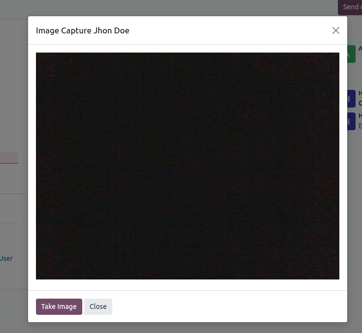
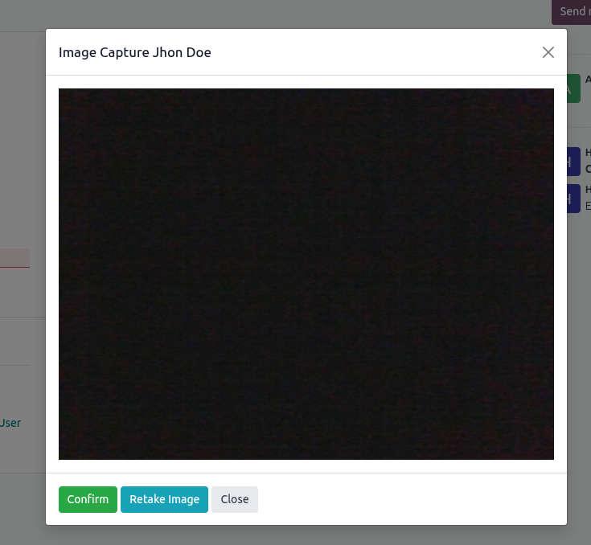

# Webcam Image Capture
Add functionality in odoo image field to take image from webcam

- Move your cursor to the bottom of the box in the image field and click on the camera icon
 

 
- You can now take the desired photo using your webcam
 

 
